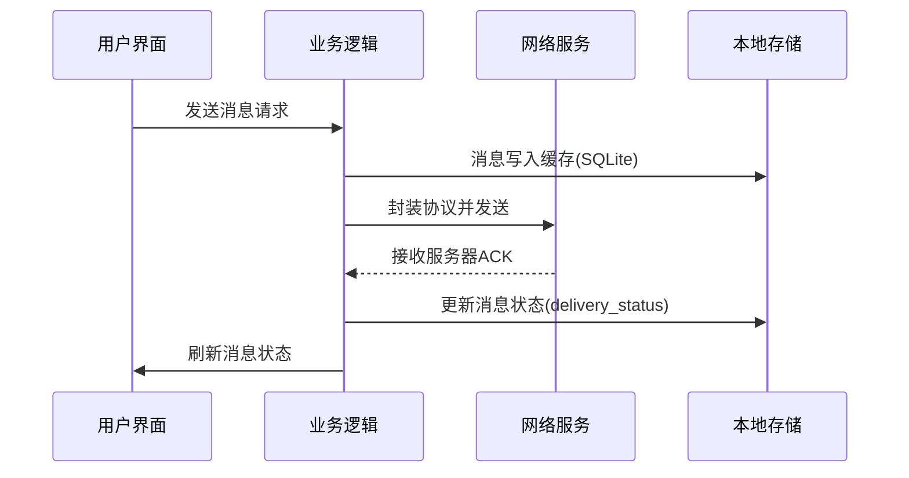

# 客户端架构设计

## 分层架构

```
├── 表现层(Presentation)
│   ├── QWidget界面框架  # 核心聊天窗口
│   └── QML动态界面     # 响应式布局
│
├── 业务层(Business Logic)
│   ├── 消息处理器      # 编解码/加密/解密
│   ├── 文件传输引擎    # 分块/校验/续传
│   └── 状态管理机      # 登录/连接/断网恢复
│
├── 服务层(Services)
│   ├── 网络服务        # QSslSocket管理
│   ├── 存储服务        # SQLiteCipher
│   └── 推送服务        # 本地通知
│
└── 基础设施(Infrastructure)
    ├── 配置管理        # INI解析器
    ├── 日志系统        # 分级日志
    └── 异常处理        # 崩溃报告
```

## 核心模块交互



## 线程池设计

客户端采用Qt的`QThreadPool`和`QRunnable`来管理并发任务：

- **主线程**：负责UI渲染和事件处理
- **网络线程**：使用线程池处理网络请求（发送消息、文件传输等），避免阻塞UI
- **数据库线程**：使用单独的线程进行本地SQLite数据库操作

### 线程间通信

- 使用信号槽机制（Qt的自动连接方式，跨线程队列连接）
- 网络线程与主线程之间通过信号槽进行数据传递
- 数据库操作通过异步任务队列处理

## 关键特性

### 网络连接管理
- 使用`QSslSocket`建立安全连接
- 自动重连机制：30秒无活动触发自动重连
- 心跳检测：定期发送心跳包维持连接

### 数据缓存策略
- 使用SQLiteCipher进行本地数据加密存储
- LRU缓存淘汰策略：自动清理90天前旧消息
- 消息状态跟踪：记录消息的发送、接收、已读状态

### 文件传输优化
- 分块传输：大文件分块传输，支持断点续传
- MD5校验：每个文件块进行MD5校验确保完整性
- 带宽限制：防止大文件占用全部网络带宽
- 区块索引持久化：意外退出后可恢复传输进度

### UI响应性
- 异步操作：所有耗时操作都在后台线程执行
- 实时更新：消息状态变化实时反映到UI
- 流畅体验：网络延迟不影响UI响应 