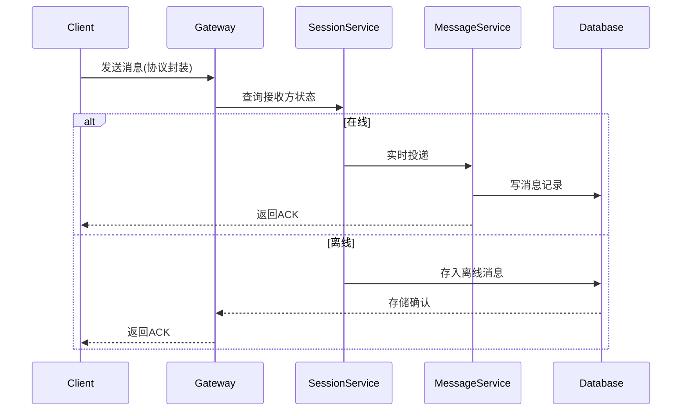
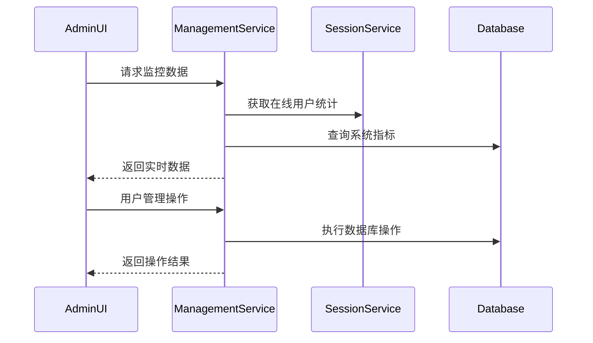

# 服务器端架构设计

## 微服务化架构

```
├── 接入网关(Gateway)
│   ├── QSslServer实例    # 10k连接/实例
│   ├── 协议适配器        # 二进制协议解析
│   └── 负载均衡器        # 连接分发
│
├── 核心服务(Core Services)
│   ├── 会话服务          # 用户在线状态管理
│   ├── 消息路由          # 一对一/群聊消息分发
│   ├── 文件服务          # 分块存储/校验
│   ├── 推送服务          # 离线消息缓存
│   └── 管理服务          # 后台管理界面服务（新增）
│
├── 数据层(Data Layer)
│   ├── MySQL访问层       # 分库分表代理
│   ├── Redis缓存代理     # 会话/热点数据
│   └── S3存储适配器      # 文件存储抽象
│
├── 支撑系统(Supporting)
│   ├── 配置中心          # etcd动态配置
│   ├── 监控系统          # Prometheus指标
│   └── 日志收集          # ELK栈
│
└── 管理界面(Admin UI)    # Qt后台管理界面（新增）
    ├── 仪表板            # 实时监控数据展示
    ├── 用户管理          # 用户信息管理
    ├── 系统配置          # 服务器参数配置
    └── 日志查看          # 系统日志查看
```

## 关键业务流程 - 消息投递



## 管理界面业务流程



## 服务间接口

| 服务          | 接口协议       | 端口   | 说明                     |
|---------------|---------------|--------|--------------------------|
| 网关→会话服务 | gRPC          | 50051  | 实时查询用户连接节点     |
| 消息→存储     | MySQL协议     | 3306   | 消息持久化               |
| 文件→对象存储 | S3 REST API   | 9000   | MinIO兼容接口            |
| 监控数据      | Prometheus    | 9090   | 指标采集                 |
| **管理界面→管理服务** | **HTTP REST API** | **8080** | **后台管理接口（新增）** |

## 线程池设计

服务器端采用固定大小的线程池（避免资源耗尽），每个线程运行一个事件循环（Event Loop）：

- **主线程**：负责监听端口，接受新连接，并将新连接分发给工作线程
- **I/O线程**：每个线程处理多个连接的I/O事件（使用非阻塞I/O和事件通知机制）
- **工作线程**：处理业务逻辑（如消息转发、数据库操作等），避免阻塞I/O线程
- **管理线程**：处理后台管理界面的UI事件和业务逻辑（新增）

### 线程间通信

- I/O线程与工作线程之间使用任务队列（生产者-消费者模型）
- 使用Qt的信号槽进行跨线程通知（注意：使用`Qt::QueuedConnection`）
- 管理界面线程通过信号槽与核心服务通信（新增）

## 线程模型优化

1. **I/O线程**：仅负责网络数据的接收和发送，不处理业务逻辑
2. **工作线程**：从任务队列中取出任务并执行，如消息处理、数据库操作等
3. **数据库连接池**：每个工作线程使用独立的数据库连接，避免竞争
4. **管理界面线程**：独立线程处理UI事件，避免阻塞核心服务（新增）

## 高可用设计

### 负载均衡
- 网关层实现连接分发
- 支持水平扩展，多个网关实例
- 健康检查机制，自动剔除故障节点

### 数据一致性
- 使用分布式锁保证数据一致性
- 消息队列确保消息不丢失
- 数据库主从复制，读写分离

### 容灾备份
- 定期数据备份
- 多机房部署
- 故障自动切换

## 性能优化

### 连接管理
- 连接池复用TCP连接
- 心跳检测及时清理僵尸连接
- 连接数限制防止资源耗尽

### 缓存策略
- Redis缓存热点数据
- 本地缓存减少网络请求
- 缓存预热机制

### 数据库优化
- 索引优化查询性能
- 分库分表处理大数据量
- 读写分离减轻主库压力

## 管理界面特性

### 实时监控
- 在线用户数量统计
- 消息吞吐量监控
- 系统资源使用情况
- 网络连接状态监控

### 用户管理
- 用户信息查看和编辑
- 用户状态管理（启用/禁用）
- 用户权限配置
- 用户行为分析

### 系统配置
- 服务器参数配置
- 数据库连接配置
- 日志级别设置
- 安全策略配置

### 日志查看
- 实时日志流查看
- 日志级别过滤
- 日志搜索功能
- 日志导出功能 